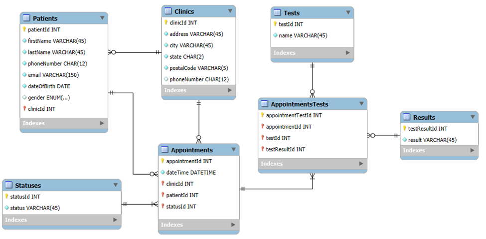

# Capital Family Clinic

View live site: https://capital-family-clinic.vercel.app/

## Clinic Appointment Management System

A Flask-based clinic appointment management system designed to streamline patient tracking, appointment scheduling, and test result management across multiple locations.

## Overview

A for-profit medical clinic business in the United States needs a website with a database backend to track its patients, clinic locations, tests, and appointments. The business currently relies on Excel spreadsheets to manage its data, but with anticipated growth, a more efficient system is needed. The business operates 3 locations but has plans to open 7 more clinics by the end of the year. The main clinic sees an average of 30-40 patients each day. The primary purpose of the clinics is to offer basic medical tests, rather than performing advanced surgery or imaging procedures. Each location offers the same easy point-of-care testing procedures to allow patients to choose their preferred clinic. The management team will use this new software system to determine information such as how busy each clinic is and which tests are most requested.

## Database
This database currently stores the following information:
- Clinics: Represents the location of a clinic where appointments take place.
- Patients: Represents a patient who may make an appointment at a clinic.
- Appointments: Represents an appointment for a patient.
- Statuses: Represents the appointment status. Each status (Scheduled, Walk In, No Show, Cancelled, Complete) is represented by a specific statusId.
- Results: Represents the results of a test. Each result (positive, negative, or invalid) is represented by a specific testResultId.
- Tests: Represents a test that a patient may take at the clinic.
- Scheduled Tests: Represents the M:N relationship between appointments and tests. Each scheduled test is also associated with one test result.

<br>



## Features
- Clinics: Add, update, delete
- Patients: Add, update
- Appointments: Add, update, delete, filter by patient name
- Statuses: Update
- Results: Update
- Tests: Add, update, delete
- Scheduled Tests: Add, update, filter by patient name, filter by tests, view chart of requested tests
- Reset database to default data (`sp_load_clinicdb()`)
- Export data to excel

## Technologies
- Python, Flask
- MySQL
- JavaScript
- Chart.js
- GitHub Actions (CI/CD) 

## Set Up Locally

### Environment Variables

Create a `.env` file in your project root and populate it with your database credentials and secret key. Example:

```env
HOST=""       # Database host URL
PORT=""       # Database port (usually 3306)
USER=""       # Database username
PASSWORD=""   # Database password
DB=""         # Database name
SECRET_KEY="" # Flask secret key for sessions
```

In this project, the MySQL database is hosted on Aiven.

### Populate database
1. Run [`DDL.sql`](DDL.sql) to create tables and schema
2. Execute `CALL sp_load_clinicdb();` to load default data
3. Execute [`PL.sql`](PL.sql) to create stored procedures used by the app

### Set up Environment
```
# Create virtual environment
python -m venv .venv

# Activate environment
source .venv/Scripts/activate  # Windows
# or
source .venv/bin/activate      # Linux/macOS

# Install dependencies
pip install -r requirements.txt
```

### Run the app
Start the flask server:
```
flask run
```